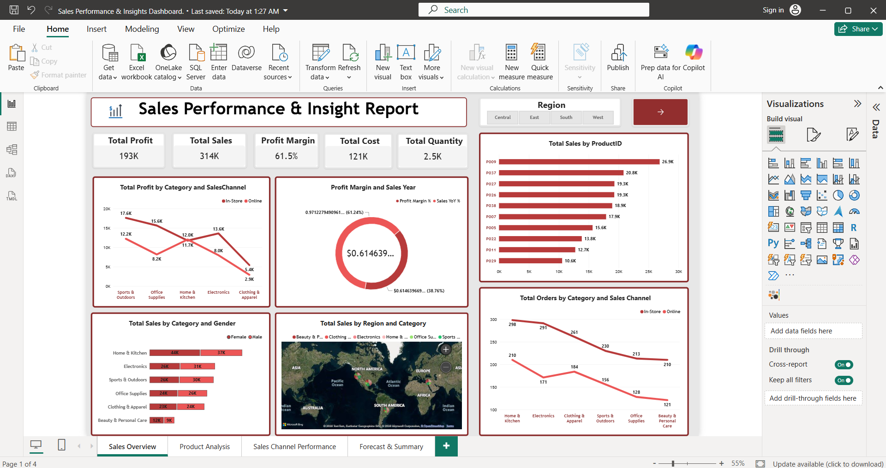
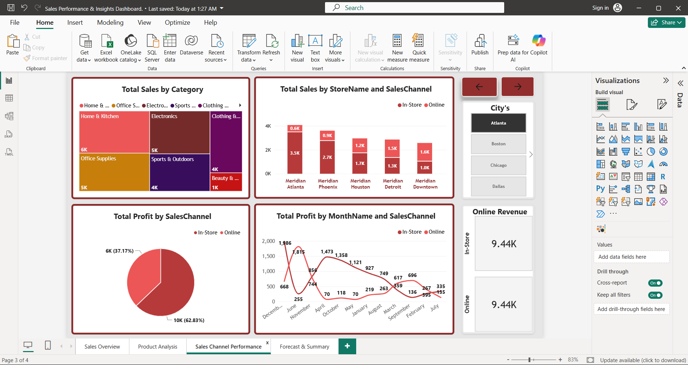
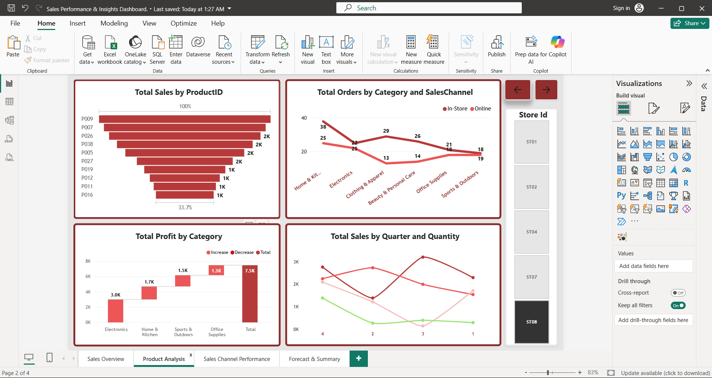

# 📊 Retail Sales Performance & Insights Dashboard

## 📌 Project Overview

This project is an interactive **Retail Sales Performance & Insights Dashboard** developed using **Microsoft Power BI**.

The dashboard analyzes retail sales data to provide insights into **sales, profit, cost, orders, products, categories, regions, cities, sales channels, and monthly performance**.

The goal of this project is to transform raw retail data into meaningful business insights that can help managers make **data-driven decisions**.

---

## 🎯 Business Objectives

The dashboard helps answer important business questions such as:

* Which regions generate the highest sales?
* Which cities generate the highest profit?
* Which product categories perform best?
* What are the monthly sales and profit trends?
* How does weekday performance compare with weekend performance?
* Which sales channels perform better?
* What is the overall profit margin?
* Which products or categories need improvement?
* What does the future sales trend look like?

---

## 🛠️ Tools & Technologies

* **Microsoft Power BI**
* **Power Query**
* **DAX (Data Analysis Expressions)**
* **Microsoft Excel**
* **Data Cleaning & Transformation**
* **Data Modeling**
* **Data Visualization**
* **Time Intelligence**
* **Forecasting**

---

## 📊 Dashboard Pages

### 1. Sales Overview

The Sales Overview page provides a high-level summary of the retail business.

### Key KPIs

* Total Sales
* Total Profit
* Total Cost
* Profit Margin %
* Sales YoY %
* Total Orders

### Analysis Included

* Region-wise performance
* Category-wise analysis
* City-wise sales and profit
* Monthly sales and profit
* Weekday vs. weekend analysis

### Dashboard Preview

---

## 2. Sales Channel Performance

This page analyzes sales performance across different sales channels.

### Analysis Includes

* Sales by channel
* Profit by channel
* Order performance
* Channel comparison
* Sales trends

### Dashboard Preview

---

## 3. Product Analysis

This page focuses on product and category-level performance.

### Analysis Includes

* Product sales
* Product profit
* Category performance
* Top-performing products
* Underperforming products
* Sales and profit comparison

### Dashboard Preview

---

## 4. Forecast & Summary

This page provides trend analysis and forecasting to understand potential future sales performance.

### Analysis Includes

* Sales trends
* Profit trends
* Historical performance
* Forecasting
* Business performance summary

### Dashboard Preview

---

## 🧮 Data Analysis & DAX

DAX measures were created to calculate important business KPIs such as:

* Total Sales
* Total Profit
* Total Cost
* Total Orders
* Profit Margin %
* Sales YoY %
* Monthly Sales
* Monthly Profit

The project also uses a **Date Table** for time-based analysis and time-intelligence calculations.

---

## 🔄 Data Preparation

The data was prepared using **Power Query**.

The main data preparation steps included:

1. Importing the retail sales dataset
2. Checking data types
3. Cleaning missing values
4. Removing unnecessary data
5. Transforming columns
6. Creating calculated columns
7. Creating a Date Table
8. Building relationships between tables
9. Creating DAX measures
10. Building interactive Power BI dashboards

---

## 📈 Key Business Insights

The dashboard can be used to identify:

* High-performing and low-performing regions
* High-performing cities
* Best-performing product categories
* Monthly sales trends
* Profitability trends
* Weekday and weekend order patterns
* Sales channel performance
* Products contributing most to revenue and profit

---

## 📂 Project Files

| File                                          | Description                             |
| --------------------------------------------- | --------------------------------------- |
| `Sales Performance & Insights Dashboard.pbix` | Power BI dashboard project              |
| `Meridian_Retail_Sales_Dataset.xlsx`          | Retail sales dataset                    |
| `Sales_Overview.png`                          | Sales Overview dashboard screenshot     |
| `Sales_Channel_Performance.png`               | Sales Channel dashboard screenshot      |
| `Product_Analysis.png`                        | Product Analysis dashboard screenshot   |
| `Forecast_Summary.png`                        | Forecast & Summary dashboard screenshot |

---

## 💡 Skills Demonstrated

**Power BI | DAX | Power Query | Excel | Data Cleaning | Data Transformation | Data Modeling | Business Intelligence | Data Visualization | KPI Development | Sales Analytics | Time-Series Analysis | Forecasting**

---

## 🚀 Project Outcome

Developed a multi-page interactive Power BI dashboard that converts raw retail sales data into actionable business insights.

The project demonstrates practical knowledge of **data analytics, business intelligence, dashboard development, DAX calculations, data modeling, and visualization**.

---

## 👨‍💻 Author

Shrikant Akolkar

B.tech Data Science Student

### Skills

Power BI • SQL • Python • Excel • Data Analytics • Data Science

---

## 🔗 Project Repository

GitHub Repository:

**[Retail Sales Performance & Insights Dashboard](https://github.com/)**

---

⭐ If you found this project useful, feel free to explore the dashboard and analysis.
